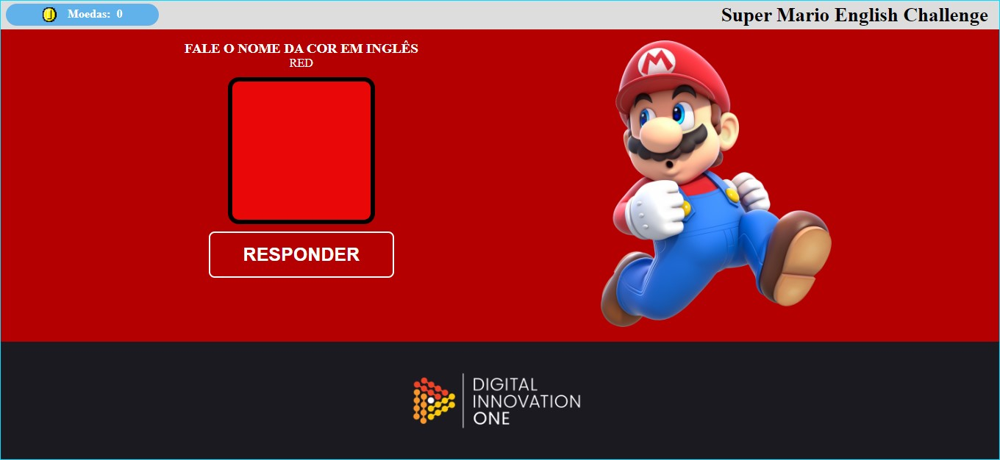

<h1 align="center">
API de Reconhecimento de voz
</h1>
<h4 align="center">
Super Mário English Challenge
</h4> 

Jogo do Super Mario para responder o nome das cores em inglês usando a API nativa: **Speech Recognition** (de reconhecimento de voz), **HTML, CSS, JavaScript.**

Esse projeto:

* Possui layout construído com <strong>Flexbox</strong>; 
* Você pode responder em áudio para se comunicar com o navegador.  

    

Desenvolvido em:

-  [HTML5](https://developer.mozilla.org/pt-BR/docs/Web/HTML/HTML5)
-  [CSS3](https://developer.mozilla.org/pt-BR/docs/Archive/CSS3)
-  [Javascript](https://developer.mozilla.org/pt-BR/docs/Aprender/JavaScript)

Foi criado com a tutoria do Felipe Aguiar da Digital Innovation One.

